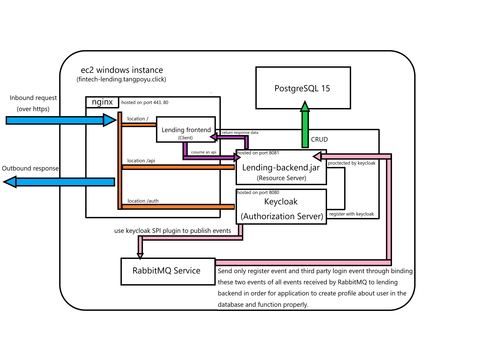

# [Fintech-Lending-Application](https://fintech-lending.tangpoyu.click/)

This project is for learning Web development about Spring boot, Angular, Keycloak, AWS, RabbitMQ, and Nginx.

## App Objective:
Implement an application which mocks to supply peer to peer lending transaction in a monolithic architecture.

## App architecture:
This app has a frontend (Lending frontend) which is built with Angular and a backend (Lending-backend.jar) which is built with Spring boot and uses Keycloak to supply OpenID ConnectID support and
RabbitMQ to handle the exchange of messages between components of a system and PostgreSQL 15 as its RDBMS and nginx as a front-end server to distribute incoming requests among multiple backend servers
for the sake of efficient load balancing and serve user interface composed of content of frontend built with angular, and lastly they all are deployed on
AWS ec2 instance which is of type Windows.

### Security
In the context of security, the frontend is referred to as "Client"(application) and backend is referred to as "Resource Server", they are all protected by keycloak which 
is referred to as "Authorization Server", and I selected public client as client's access type due to the type of application it belongs which is Single Page Application(SPA)
and "Authorization Code Grant with PKCE" as its authorization grant type, in this way the safety can be improved through creating a secret and using it 
on the fly when exchanging authorization code with token and to make up for the loss of security which caused by public client
that can't use secret to authenticate with authorization server to add additional layer of security. In addition, I have added another step in the authentication flow which is 
One time password(OTP) to add additional layer of security, and then, in the end, if the user has just completed registration then he/she needs to verify their email for the purpose of
validation of data.

* Authorization code grant with PKCE : As a best practice for SPA to secure itself using OpenID Provider (keycloak) based on OAuth 2.0 and OpenID Connect specification
and mitigate the malicious attack from attacker.

* One time password (OTP) : By configuring OTP of Authenticator provider then all user have to fill in six digit for verifying identify of user when logging.

* Verify email : After registering, all user have to verify their email for the purpose of using app and the validation of data.

## Operation of App:

### Admin 

This system supplies an admin user to manage this app which has app_admin role. ( username: admin, password: 12345 )

* See Loan application : admin can see loan application which is current and past.

* See Loan : admin can see all user's loan data which is current or past.

* Remember me : you can turn the login cookie from a session-only cookie to a persistence cookie by checking remember me checkbox.

****

### User

* Register user : through login page, you can register a user by register link or identity provider ( GitHub, Google ), and will be mapped an app_user role by default.

* Login : you can log in through filling up the credentials or identify provider ( Github, Google ).

* Request loan application : you can request a loan application by filling up the info of loan application form in Request Loan page.      **(Note: currencyType only support NT, USD)**

* See Loan application : you can see current loan application from loan application page except the application which is requested by self.

* See Borrowed and Lent loan: you can see all own borrowed and lent loan data which is current or past from Borrowed page and Lent page.

* Repay loan : you can repay loan in borrowed page through clicking the loan and then filling up the repay loan info of form.

* Recharge money : you can recharge money in Recharge page.  **(Note: currencyType only support NT, USD)**

* Set basic information : you can set age and occupation in Setting page.

* Logout : you can log out user by clicking the logout button on the top right.

* Reset password : you can reset password by clicking link of reset password.

* Remember me : you can turn the login cookie from a session-only cookie to a persistence cookie by checking remember me checkbox.

